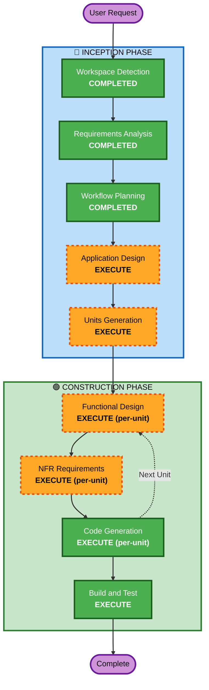

# Execution Plan

## Detailed Analysis Summary

### Change Impact Assessment
- **User-facing changes**: Yes — 전체 새 UI (SkyMap + Controls + Panels)
- **Structural changes**: Yes — Backend API + Frontend SPA 신규 생성
- **Data model changes**: Yes — Pydantic 모델, API request/response 스키마
- **API changes**: Yes — 3개 엔드포인트 신규 (POST /api/observe, GET /api/locations, GET /api/constellations/{code})
- **NFR impact**: Yes — 응답 시간 ≤500ms, 좌표 오차 ≤1°, 번들 크기 제한

### Risk Assessment
- **Risk Level**: Low (localhost 전용, 단일 사용자, 외부 의존 없음)
- **Rollback Complexity**: Easy (greenfield — 삭제 후 재시작 가능)
- **Testing Complexity**: Moderate (천문 계산 정확도 검증 필요)

---

## Workflow Visualization

---

## Phases to Execute

### 🔵 INCEPTION PHASE
- [x] Workspace Detection (COMPLETED)
- [x] Requirements Analysis (COMPLETED)
- [x] User Stories (SKIPPED — 단일 사용자 앱, 명세 충분)
- [x] Workflow Planning (COMPLETED)
- [ ] Application Design — EXECUTE
  - 컴포넌트 식별 + 서비스 레이어 설계 필요 (천문 계산 모듈, API 레이어, UI 컴포넌트)
- [ ] Units Generation — EXECUTE
  - 2-unit 분할: `backend` / `frontend`

### 🟢 CONSTRUCTION PHASE (per-unit)
- [ ] Functional Design — EXECUTE
  - 데이터 모델, API 스키마, 비즈니스 로직 상세 설계
- [ ] NFR Requirements — EXECUTE
  - 응답 시간, 좌표 정확도, 번들 크기 기준 정의
- [ ] NFR Design — SKIP
  - NFR 패턴이 단순 (캐싱/인덱싱 정도), 별도 설계 문서 불필요
- [ ] Infrastructure Design — SKIP
  - localhost 전용, 인프라 매핑 불필요 (AGENTS.md §2.4)
- [ ] Code Generation — EXECUTE (per-unit)
  - Part 1: 계획 → Part 2: 코드 생성
- [ ] Build and Test — EXECUTE
  - pytest (backend) + tsc --noEmit + vite build (frontend)

### 🟡 OPERATIONS PHASE
- [ ] Operations — PLACEHOLDER (해당 없음)

---

## Success Criteria
- **Primary Goal**: SPEC.md 검증 시나리오 6건 통과
- **Key Deliverables**: 동작하는 Backend API + Frontend SPA
- **Quality Gates**: pytest 통과, TypeScript 타입체크 통과, vite build 성공
